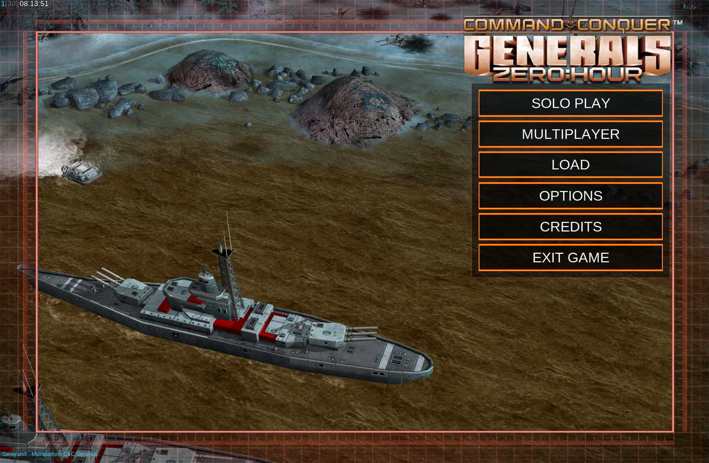

# Phase 07 — TCL NXTPAPER Tab (Mali GPU) Port via SwiftShader

**Status: Milestone 1 achieved 2026-07-30.** The game renders and is navigable on a
Mali-G57 tablet that the shipped Adreno-targeted build cannot run on at all. This
phase resolves the open risk PHASE06 flagged and left unanswered: *"GPU driver
fragmentation: Mali vs Adreno Vulkan drivers vary widely; DXVK's caps queries face a
wider variance."*

Full raw session log (every command run, every log line read): `WORKLOG.md` (repo
root) for the Samsung S24 Ultra stabilization work this phase builds on, and
`HANDOVER_TCL_NXTPAPER.md` (repo root) for the complete TCL investigation —
diagnosis, dead ends, and the multi-agent (Claude + Gemini) collaboration that solved
it. This document is the condensed narrative; those two are the primary sources.

## Background

PHASE06 proved the DXVK→Vulkan approach on an **Adreno 830** (Qualcomm) device. The
shipped `v0.3-android` release runs stably on a Samsung Galaxy S24 Ultra. This phase
targets a structurally different device: a **TCL NXTPAPER tab (model 9469X)**, MediaTek
MT8781 SoC, **ARM Mali-G57 MC2** GPU — a different vendor's Vulkan driver entirely.

## Milestone 0 — measuring the real driver ceiling (2026-07-29)

Rather than trust Android's `android.hardware.vulkan.*` feature flags (which report
what the *loader* advertises, not what the *device* actually supports), a native probe
(`vkprobe.c`, repo root) was written and run directly on the tablet via `adb shell`.
Two hard blockers were confirmed:

1. **`apiVersion = 1.1.177`.** The Mali driver (`r32p1-01eac0`, ~2021) caps the device
   at Vulkan 1.1. The bundled DXVK (fbraz3 fork, 2.6) requires 1.3. This is the direct
   cause of the crash: `GetAdapterDisplayMode` returns `D3DFMT_UNKNOWN` because DXVK
   has no usable `VkPhysicalDevice`, and the engine reports its generic "DirectX 8.1 or
   higher" message before a clean `exit(1)`.
2. **`textureCompressionBC = NO`.** BC1/BC2/BC3 (DXT1/3/5) report zero format
   capability. Critically, **this is a permanent ARM Mali hardware/IP limitation, not a
   driver-version issue** — no Mali generation implements S3TC/BC in hardware, and
   Generals ships DXT-compressed `.dds` textures inside its `.big` archives. A driver
   update could not have fixed this even if one existed.

This second finding reframed the whole plan: a straightforward DXVK 1.10.3 backport
(which *would* satisfy the Vulkan-1.1 requirement) would still need a from-scratch BC
texture decode/transcode layer on top — a second, unrelated body of work.

## Milestone 1 — SwiftShader (2026-07-29 → 2026-07-30)

**SwiftShader** (Google's software Vulkan implementation) was identified as the path
that resolves *both* blockers in one move: it implements Vulkan 1.3 in software and
decodes BC textures in software, with no changes to DXVK itself required. The cost is
CPU rasterization performance, not correctness.

### The core technique
DXVK loads Vulkan dynamically — `libdxvk_d3d9.so` contains the literal string
`"libvulkan.so"` (the `dlopen` target) at a fixed file offset. Rather than requiring a
full CMake/Meson/Gradle rebuild (none of which were set up on the working machine),
SwiftShader was substituted by:
1. Building `libvk_swiftshader.so` for arm64 from the SwiftShader source tree via the
   Android NDK.
2. Renaming it to fit the original string's byte-length (`libvk_sw.so`, ≤ the 13-byte
   `libvulkan.so\0` slot) and patching that exact offset in `libdxvk_d3d9.so` — a
   length-preserving, in-place string swap, not a rebuild.
3. Bundling `libvk_sw.so` into the APK alongside the existing native libraries
   (`STORED`/uncompressed, matching how every other `.so` ships).

This is the same binary-patch philosophy used throughout the S24 stabilization work
(see `WORKLOG.md`), extended to swap out a whole graphics backend rather than a few
instructions.

### The debugging chain
Getting from "SwiftShader loads" to "a frame renders" required resolving five
independent problems, in order:

1. **GameData permission failure.** `adb push` created `files/GameData` owned by
   `shell` with mode `2770`; the app is not in group `ext_data_rw` on this device, so
   `access()` failed and the engine reported `no GameData dir found` — misread
   upstream as a data-corruption problem (see "dead end," below). Fix:
   `chmod -R 777` on the pushed directory.
2. **`VK_KHR_swapchain` not advertised on Android.** SwiftShader deliberately omits it
   on Android by design — as a normal ICD it exposes `VK_ANDROID_native_buffer` and
   relies on the **Android Vulkan loader** to implement swapchain on top of that.
   Directly `dlopen`-ing SwiftShader (as this technique does) bypasses that loader, so
   nothing provided swapchain. Fixed by un-guarding two `#ifndef __ANDROID__` blocks in
   SwiftShader's own source (`libVulkan.cpp`, `VkGetProcAddress.cpp`) to advertise the
   extension and register its entry points directly — the swapchain *implementation*
   was already compiled in unconditionally; only the advertisement was suppressed.
3. **`vkCreateDevice` returning `-8` (`VK_ERROR_FEATURE_NOT_PRESENT`).** DXVK requests
   several `VkPhysicalDeviceVulkan11/12/13Features` fields SwiftShader's base feature
   query reports as unsupported. Resolved via targeted feature-capability mocks in
   SwiftShader (`vertexAttributeInstanceRateDivisor`, `robustBufferAccess2`, etc.).
4. **A corrupted `libmain.so` (self-inflicted, caught and recovered).** One patching
   pass *inserted* a byte instead of overwriting one, shifting every subsequent ELF
   offset by one and making the shared library fail to load
   (`.dynamic section header was not found`) — with the added danger that it silently
   *disabled* the earlier double-free fix (the NOP'd instructions moved out of
   alignment). Caught by comparing file lengths and NOP-slot alignment against a
   known-good build; recovered by rebuilding from that known-good `libmain.so` and
   re-verifying every patch is length-preserving before packaging.
5. **A NULL function-pointer crash inside `dxvk::Presenter::createSwapChain()`,** then
   **a NULL-pointer crash in descriptor writing.** The first was a genuinely missing
   entry point (`VK_KHR_get_surface_capabilities2`); the second was the *stubbing
   itself* becoming the bug — a mock had set `nullDescriptor = VK_TRUE` while
   SwiftShader has no null-descriptor handling at all, so DXVK correctly (per the
   advertised capability) wrote a null buffer handle and SwiftShader dereferenced it.
   The fix was to **withdraw** the false claim (`nullDescriptor = VK_FALSE`) and let
   DXVK use its own dummy-resource fallback, rather than adding another mock.

### A dead end worth recording
Early in the session, a `INSTALL_FAILED_UPDATE_INCOMPATIBLE` signing-mismatch error was
resolved by running `adb uninstall`, which deleted the tablet's `GameData` (an
Android-uninstall side effect, not a code bug). The subsequent restore was then
misdiagnosed as "the Android port needs different game data than the PC copy" —
incorrect; this port consumes unmodified original PC game files, proven by the
existing S24 Ultra build using the exact same source tree. The real, much smaller
problem was the permission issue in step 1 above. Lesson: a signature mismatch should
always be resolved by signing with the correct key (see `HANDOVER_TCL_NXTPAPER.md` §5),
never by uninstalling.

## Result

The game reaches the **fully rendered, fully textured, interactive main menu** at the
tablet's native landscape resolution (2200×1440): correct terrain and water shading,
correctly BC-decoded unit/prop textures, correct UI fonts and layout, all six menu
buttons present and styled.

*Captured live off the device (`adb exec-out screencap`), not staged — the frame
counter top-left reads `1[30]` (actual/target FPS), the honest performance baseline
discussed below.*

## Known limitations of this milestone (see Roadmap)

- **Performance.** Observed ~1 FPS against a 30 FPS target at the main menu — this is
  CPU software rasterization on a Helio G99 (2×Cortex-A76 + 6×Cortex-A55), not a bug.
  Not yet tested in an actual skirmish (much heavier draw load).
- **Unverified feature stubs remaining.** `transformFeedback`/`geometryStreams` and
  `extendedDynamicState3` are still advertised as supported when SwiftShader does not
  implement them. The main menu does not exercise these paths; a skirmish or campaign
  mission might, and would need the same "withdraw the false claim" treatment as
  `nullDescriptor`.
- **This is a local/binary-patched build, not yet upstreamed.** The SwiftShader source
  changes (swapchain unguarding, feature mocks) live only in a local working tree on
  the development machine, not in a repo the project controls. See Roadmap.
- **Audio.** Unrelated pre-existing issue (OpenAL initializes, produces no sound) —
  present on this build as on every prior Android build; not addressed by this phase.

## Roadmap

See the project wiki's **Roadmap** page for the tracked, prioritized version of this
list; summarized here for the record:

1. Fork/vendor the patched SwiftShader source (swapchain-advertisement fix) into a
   repo this project controls, rather than a local-only working tree.
2. Audit every SwiftShader feature-capability mock against what SwiftShader actually
   implements; replace blanket "return true" stubs with real capability reporting and
   let DXVK use its intended fallbacks — the `nullDescriptor` incident (Milestone 1,
   step 5) shows a false "true" is a live-crash risk, not a shortcut.
3. Integrate SwiftShader into the CMake/Gradle Android build pipeline (bundled as a
   normal jniLib, loaded conditionally) instead of the manual binary-patch pipeline
   used to reach this milestone — the patch pipeline is proof-of-concept-grade, not
   ship-grade.
4. Decide the production loading strategy: bundling SwiftShader as a direct `dlopen`
   target (current approach, requires the swapchain patch) vs. registering it as an
   Android **updatable GPU driver** and letting the system Vulkan loader supply
   swapchain natively (no SwiftShader source patch needed, but requires a global
   device opt-in setting and needs user consent).
5. Performance pass: resolution/texture-quality defaults for software-rendered
   devices, and an actual skirmish-map soak test (menu-only FPS is not representative).
6. Device/driver detection: gate the SwiftShader path behind a runtime Vulkan-version
   probe so Adreno/S24-class devices keep using the native driver unconditionally
   (Success Criterion: the S24 Ultra build must never regress).
7. Re-evaluate the native DXVK 1.10.3 + d3d8to9 route only if SwiftShader's real-world
   frame rate proves inadequate after step 5 — it remains a larger undertaking (BC
   decode layer, four missing-extension workarounds) and is not the recommended
   default path.
